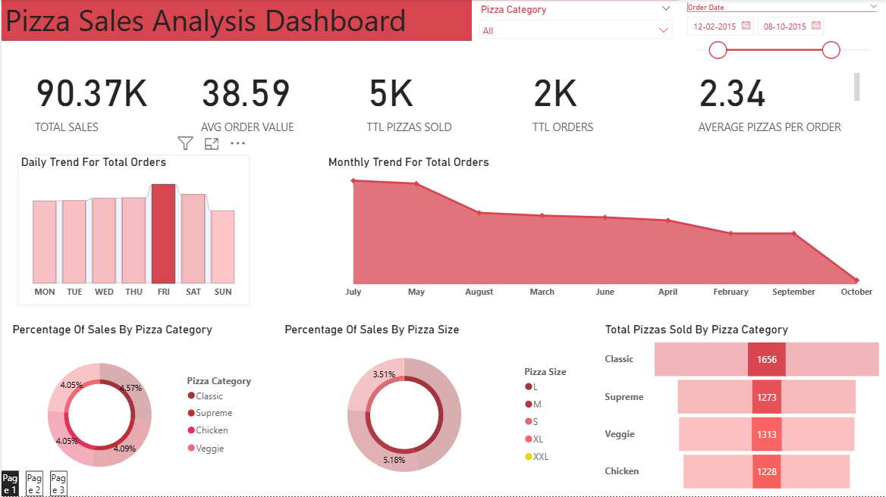
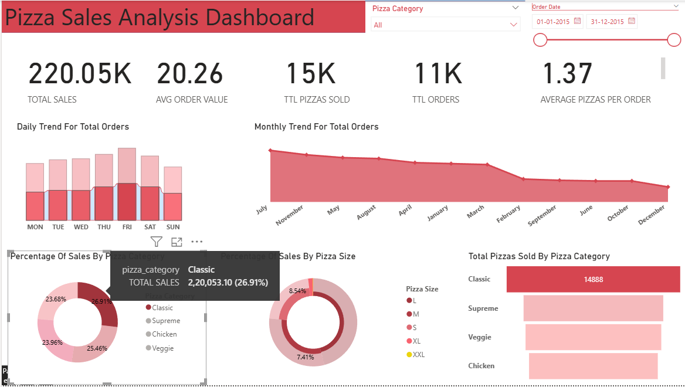
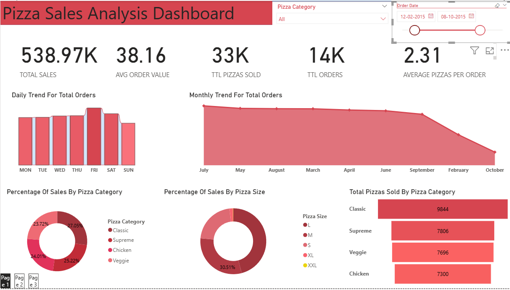
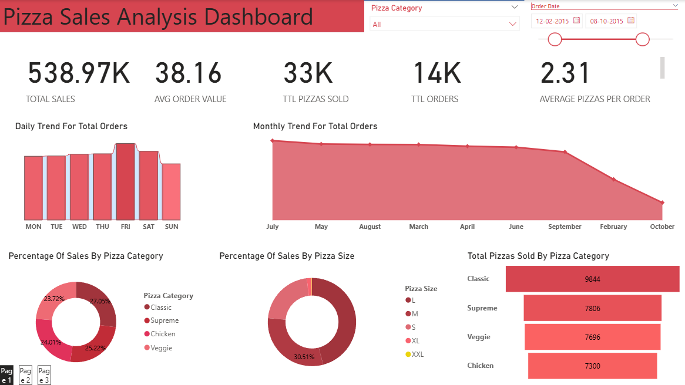
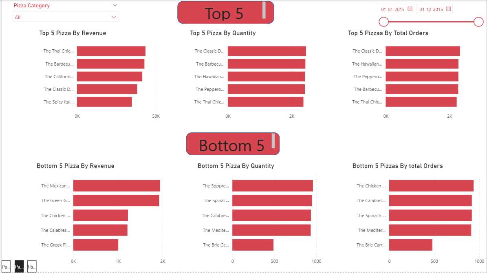
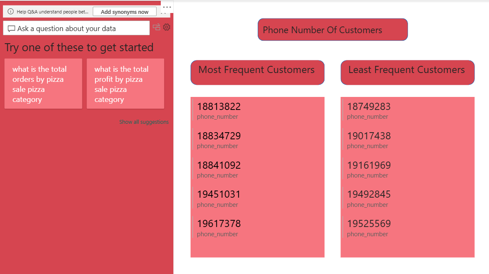

# 🍕 Pizza Sales Dashboard

An end-to-end data analytics project analyzing sales data for a hypothetical pizzeria. The project involves **SQL-based data extraction**, **data cleaning**, and an **interactive 3-page Power BI dashboard** to uncover business insights.

---

## 📌 Project Overview

| Attribute | Details |
|-----------|---------|
| **Domain** | Food & Beverage / Retail Analytics |
| **Tools Used** | SQL Server, Power BI |
| **Dataset Source** | [Maven Analytics / Kaggle – Pizza Sales Dataset](https://www.kaggle.com/datasets/mysarahmadbhat/pizza-place-sales) |
| **Data Period** | January 2015 – December 2015 |
| **Records** | 48,620 order line items across 21,350 orders |

---

## 🎮 Interactive Features

The dashboard is fully interactive — every visual acts as a filter for the rest of the page.

| Interaction | Effect |
|-------------|--------|
| Click a day in the **Daily Trend** bar chart | All visuals update to show data for that day only (e.g., Friday → 3,538 orders) |
| Click / hover a **Pizza Category** in the donut | KPIs and charts update to that category only (e.g., Classic → $2,20,053, 26.91%) |
| Drag the **Order Date** range slider | Entire dashboard filters to the selected date window |
| Select a **Pizza Category** from the slicer | Cross-filters all charts on the page |
| Type a question in the **Page 3 Q&A box** | Power BI generates a visual answer in natural language |

### 📸 Interactivity in Action

**Friday selected → all KPIs update to Friday-only data**


**Classic category hovered → tooltip shows $2,20,053 (26.91% of total)**


**Date range filtered to Feb–Oct 2015**


---

## 📊 Dashboard – 3 Pages

### Page 1 – KPI & Trend Overview


**KPI Cards**
- 💰 **Total Sales** – $817.86K
- 🧾 **Avg Order Value** – $38.31
- 🍕 **Total Pizzas Sold** – 50K
- 📦 **Total Orders** – 21K
- 📊 **Average Pizzas Per Order** – 2.32

**Charts**
- 📅 **Daily Trend for Total Orders** – Bar chart across Mon–Sun (peak: Friday with 3,538 orders)
- 📈 **Monthly Trend for Total Orders** – Area chart across all 12 months (peak: July)
- 🥧 **% of Sales by Pizza Category** – Donut (Classic 26.91%, Supreme 25.46%, Chicken 23.96%, Veggie 23.68%)
- 🍩 **% of Sales by Pizza Size** – Donut (Large dominates at ~30%)
- 📊 **Total Pizzas Sold by Category** – Horizontal bar (Classic: 14,888 | Supreme: 11,987 | Veggie: 11,649 | Chicken: 11,050)

---

### Page 2 – Top 5 & Bottom 5 Analysis


**Top 5 Pizzas** (3 metrics side-by-side)
- 🏆 **By Revenue** – Thai Chicken leads
- 🏆 **By Quantity** – Classic Deluxe leads
- 🏆 **By Total Orders** – Classic Deluxe leads

**Bottom 5 Pizzas** (3 metrics side-by-side)
- ⬇️ **By Revenue** – Brie Carre at the bottom
- ⬇️ **By Quantity** – Brie Carre at the bottom
- ⬇️ **By Total Orders** – Brie Carre at the bottom

---

### Page 3 – Customer Insights & Q&A


- 🔍 **Power BI Q&A Visual** – Ask questions in plain English (e.g., *"what is the total orders by pizza category"*) and Power BI generates a visual answer automatically
- 📞 **Most Frequent Customers** – Top 5 customers by order frequency
- 📞 **Least Frequent Customers** – Bottom 5 customers by order frequency

---

## 🗂️ Dataset Schema

The raw data consists of 4 relational tables:

```
orders          → order_id, date, time
order_details   → order_details_id, order_id, pizza_id, quantity
pizzas          → pizza_id, pizza_type_id, size, price
pizza_types     → pizza_type_id, name, category, ingredients
```

A **denormalized flat table** (`original_table.csv`) was also created for direct Power BI use, containing all 12 columns joined across the above tables.

---

## 📁 Repository Structure

```
pizza-sales-dashboard/
│
├── data/
│   ├── orders.csv
│   ├── order_details.csv
│   ├── pizzas.csv
│   ├── pizza_types.csv
│   ├── original_table.csv
│   └── DATA_DICTIONARY.md
│
├── screenshots/
│   ├── page1_overview.png
│   ├── page1_friday_filter.png
│   ├── page1_classic_tooltip.png
│   ├── page1_date_filter.png
│   ├── page2_top_bottom5.png
│   └── page3_qa_customers.png
│
├── sql/
│   └── SQLQuery.sql
│
├── Pizza_sales_dashboard.pbix
├── .gitignore
└── README.md
```

---

## 🔍 SQL Analysis Performed

The `SQLQuery.sql` file contains **16 analytical queries** covering:

| # | Analysis |
|---|----------|
| 1 | Total Revenue |
| 2 | Average Order Value |
| 3 | Total Pizzas Sold |
| 4 | Total Orders Placed |
| 5 | Average Pizzas Per Order |
| 6 | Orders by Day of Week |
| 7 | Orders by Month |
| 8 | Revenue % by Pizza Category |
| 9 | Revenue % by Pizza Size |
| 10 | Units Sold by Pizza Category |
| 11–12 | Top 5 & Bottom 5 by Revenue |
| 13–14 | Top 5 & Bottom 5 by Quantity |
| 15–16 | Top 5 & Bottom 5 by Total Orders |

> Each query is written in **two versions** — one using the flat `pizza_sales` table and one using the normalized relational schema with JOINs.

---

## 🚀 How to Reproduce

### SQL Analysis
1. Import the CSV files into **SQL Server**
2. Run queries in `sql/SQLQuery.sql` sequentially
3. The flat `original_table.csv` can be loaded directly as the `pizza_sales` table

### Power BI Dashboard
1. Open `Pizza_sales_dashboard.pbix` in **Power BI Desktop**
2. If prompted, update the data source path to your local `data/` folder
3. Click **Refresh** to reload the data
4. Use the slicers and date slider on each page to explore interactively

---

## 💡 Key Insights

- **Fridays** record the highest orders (3,538); **Sundays** are the slowest
- **July** is the peak month; **October** sees the lowest volume
- **Classic** category leads in both revenue (~27%) and units sold (14,888)
- **Large** size pizzas drive the highest revenue share (~30%)
- **Thai Chicken Pizza** is the top revenue earner; **Brie Carre Pizza** ranks lowest across all three metrics
- Customer frequency data (Page 3) enables targeted loyalty and retention campaigns
